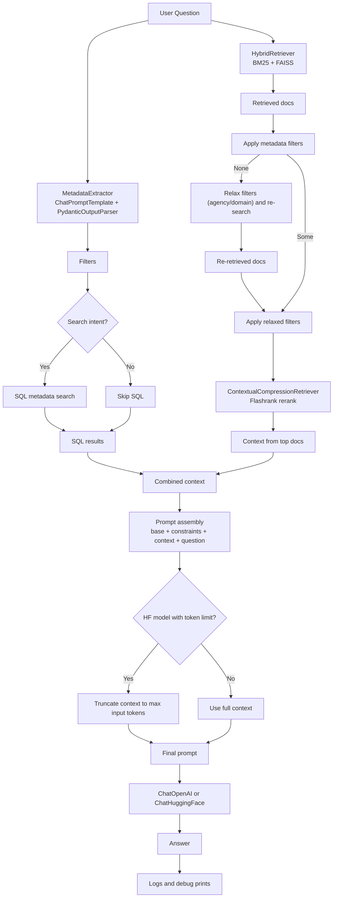

```mermaid
flowchart TD
    Q[User Question] --> M[MetadataExtractor
ChatPromptTemplate + PydanticOutputParser]
    M --> F[Filters]
    F --> I{Search intent?}
    I -->|Yes| S[SQL metadata search]
    I -->|No| S0[Skip SQL]
    S --> C1[SQL results]
    S0 --> C1

    Q --> R[HybridRetriever
BM25 + FAISS]
    R --> D[Retrieved docs]
    D --> AF[Apply metadata filters]
    AF -->|None| RF["Relax filters (agency/domain) and re-search"]
    RF --> D2[Re-retrieved docs]
    D2 --> AF2[Apply relaxed filters]
    AF -->|Some| AF2
    AF2 --> RR[ContextualCompressionRetriever
Flashrank rerank]
    RR --> C2[Context from top docs]

    C1 --> C[Combined context]
    C2 --> C
    C --> PT[Prompt assembly
base + constraints + context + question]

    PT --> TL{HF model with token limit?}
    TL -->|Yes| TR[Truncate context to max input tokens]
    TL -->|No| P0[Use full context]
    TR --> P[Final prompt]
    P0 --> P

    P --> LLM[ChatOpenAI or ChatHuggingFace]
    LLM --> A2[Answer]
    A2 --> LOG[Logs and debug prints]
```