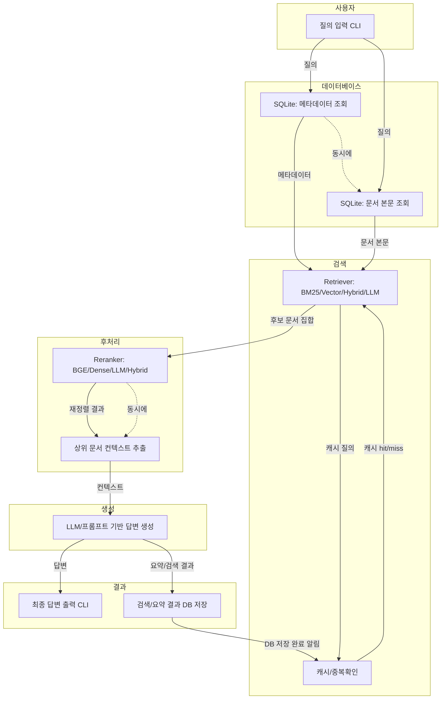

# midprj_main.py 커맨드라인 질의응답 파이프라인 (병렬적/데이터 흐름 강조)

아래는 주요 컴포넌트 간 데이터 흐름과 병렬적 처리를 강조한 Mermaid 그래프입니다.

- 메타데이터/본문 조회, 캐시 확인 등은 병렬적으로 처리될 수 있음을 점선으로 표현
- 각 컴포넌트 간 데이터가 주고받는 흐름을 명확히 화살표로 표시
- 검색 결과와 요약 결과는 DB에 저장되어 재활용 및 캐싱에 활용됨
